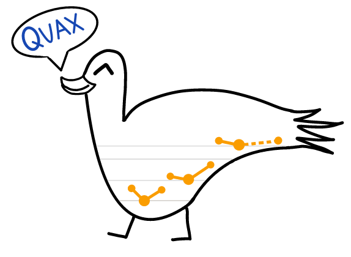

# Quax 


You have just found Quax. We have just gone open-source. Pardon our dust while we tidy things up.
The paper outlining this package was just recently submitted, and this repo will be updated with a link once published. 

### Arbitrary Order Nuclear Derivatives of Electronic Energies
This library supports a simple and clean API for obtaining higher-order energy derivatives of electronic
structure computations such as Hartree-Fock, second-order Moller-Plesset perturbation theory (MP2), and
coupled cluster with singles, doubles, and perturbative triples excitations [CCSD(T)].
Whereas most codes support only analytic gradient and occasionally Hessian computations,
this code can compute analytic derivatives of arbitrary order. 
The code can be easily extended to support other methods, for example
using the guidance offered by the [Psi4Numpy project](https://github.com/psi4/psi4numpy).

The API is very simple. A full derivative tensor (an entire gradient w.r.t. all Cartesian coordinates,
or the full Hessian, or the full cubic and quartic derivative tensors, etc) for a molecule
at a given level of theory and be computed as follows: 

```python
import psijax
import psi4

molecule = psi4.geometry('''
                         0 1
                         H 0.0 0.0 -0.80000000000
                         H 0.0 0.0  0.80000000000
                         units bohr
                         ''')

hessian = psijax.core.derivative(molecule, 'cc-pvdz', 'ccsd(t)', order=2)
print(hessian)
```

Full derivative tensor computations may easily run into memory issues. For example, the two electron integrals second derivative tensor used in the above computation
for _n_ basis functions and _N_ cartesian coordinates at derivative order _k_ contains $n^4 * N^k$ double precision floating point numbers, which requires a great deal of memory. 
Not only that, but the regular two-electron integrals and the two-electron integral _gradient_ tensor are also held in memory.
The above computation therefore, from having 10 basis functions, stores 3 arrays associated with the two-electron integrals at run time:
each of shapes (10,10,10,10), (10,10,10,10,6), and (10,10,10,10,6,6). 
These issues also arise in the simulatneous storage of the old and new T1 and T2 amplitudes during coupled cluster iterations.

Because of this performance bottleneck, the library also supports **partial derivative** computations.
These computations compute _just one_ element of the derivative tensor at a particular order (for example, a single element of the _N_ by _N_ Hessian).

```python
import psijax
import psi4

molecule = psi4.geometry('''
                         0 1
                         H 0.0 0.0 -0.80000000000
                         H 0.0 0.0  0.80000000000
                         units bohr
                         ''')

dz1_dz2 = psijax.core.partial_derivative(molecule, '6-31g', 'mp2', order=2, address=(2,5))
print(dz1_dz2)
```

In the above, the `address` argument is the 0-based indexing location of the partial derivative in the derivative tensor.
Since H2 has 6 Cartesian coordinates, the derivative tensor at order=2 (Hessian) is a 6 by 6 array, with indices along each dimension running from 0 to 5. 
The indices 0 to 5 correspond to the row-wise flattened Cartesian coordinate vector.
Therefore, the ordering of the Cartesian coordinates in the molecule definition affects which partial derivative `address` is referring to.

### Caveats


### Installation Instructions

### Anaconda Environment installation instructions
If you have a working installation of Libint with derivatives
`conda create -n quax python=3.7`
`conda activate quax`


The library requires several dependencies, most of which are taken care of with `setup.py`.
To install, clone this repository, and run 
```pip install .```
If you plan to develop/edit/play around with the code,
install with `pip install -e .` so that the installation will automatically update when changes are made.
This takes care of the following dependencies, according to the contents of `setup.py`.
```
numpy
jax
jaxlib
h5py
```

In addition to the dependencies in `setup.py`, this library requires an installation of Psi4.
The easiest way to install psi4 is with Anaconda:
`conda install -c psi4 psi4`
If you do not want to use Anaconda, you can install Psi4 from source (much more difficult).
These installation options (Psi4, and the dependencies in `setup.py`) are sufficient
for computing derivatives of electronic structure methods.

### Integral Derivative Computation
A primary bottleneck of the code is the computation of nuclear derivatives of one and two electron integrals over Gaussian basis functions.
We feature a very simple integral code built using entirely JAX utilities in the `integrals/oei.py` and `integrals/tei.py`. 
This code works for arbitrary angular momentum and arbitary order derivatives, however it is quite slow and has high memory usage
due to the overhead associated with JIT compilation and the derivative code generation _which occurs every time the program is run_.

To avoid that performance issue, simply use the library with [Libint](https://github.com/evaleev/libint) (**strongly** recommended).
Note that Libint needs to be configured for the order of differentation and maximum angular momentum
you wish to support. By default, higher order derivatives of one and two electron integrals are not configured,
they have to be specifically requested, e.g. for fourth derivatives, 
it must be compiled with configure flags `--enable-1body=4 --enable-eri=4`. See the Libint installation instructions for details.
Depending on these configuration options, the generation of a Libint library and subsequent compilation 
can take a few days or even over a week. A preconfigured tarball which supports up to f functions and
fourth order derivatives will be made available by some means in the future. 

For building with Libint, more dependencies are introduced, some of which are needed for Libint, and others
are needed for the Libint interface for this software. I strongly recommend dumping everything
into a clean Anaconda environment.
To generate a clean conda environment for running the code,
```
conda create -n psijax python=3.6
conda activate psijax 
conda install -c psi4 psi4
```

Then install the dependencies needed for the Libint interface:
```
conda install -c conda-forge pybind11
conda install -c omnia eigen3
conda install hdf5
conda install gmp
conda install bzip2
conda install boost
conda install cmake
conda install libstdcxx-ng
conda install -c conda-forge libcxx
```


NEW  have to install
```
conda create -n jax python=3.6
conda activate jax
conda install ninja
conda install -c omnia eigen3
conda install gcc
conda install -c conda-forge pybind11
conda install gcc_linux-64  ###THIS ONE
conda install boost
```

Libint's gmp issues can be taken care of by installing `conda install gcc_linux-64`
Also need `conda install gxx_linux-64` 


### Building the Libint Interface

The default gcc version 4.8 that comes with `conda install gcc` is not recent enough to successfully compile the Libint interface.
You must instead use a more modern compiler. To do this in anaconda, we need to use
`x86_64-conda_cos6-linux-gnu-gcc` as our compiler instead of gcc.
This is available by installing `gcc_linux-64` and `gxx_linux-64`.
Thus a complete anaconda envrionment, containing everything you need to run the code and compile the Libint interface,
would include:

```
conda create -n ad python=3.6
conda activate ad
conda install -c psi4 psi4
conda install gcc_linux-64
conda install gxx_linux-64
conda install -c omnia eigen3
conda install -c conda-forge pybind11

pip install jax
pip install jaxlib
conda install h5py
```

These are sufficient to compile the Libint interface.
Head over to `external_integrals/` directory and edit the makefile with the appropriate paths.
All of the required headers and libraries should be discoverable in the anaconda environment's include and lib paths.
After editing the paths appropriately and setting the CC compiler to `x86_64-conda_cos6-linux-gnu-gcc`,

Libint's gmp issues can be taken care of by installing `conda install gcc_linux-64`
Also need `conda install gxx_linux-64` 


Now, given a Libint tarball which supports the desired maximum angular momentum and derivative order,
we need to unpack the library, `cd` into it, and `mkdir PREFIX` where the headers and static library will be stored.
Then it is built and compiled. The position independent code flag is required for Libint to play nice with pybind11.
The `-j4` flag instructs how many processors to use in compilation, and can be adjusted according to your system. The `--target check` runs the Libint test suite; it is not required.
```
tar -xvf libint_*.tgz
cd libint-*/
mkdir PREFIX
cmake . -DCMAKE_INSTALL_PREFIX=/path/to/libint/PREFIX/ -DCMAKE_POSITION_INDEPENDENT_CODE=ON
cmake --build . -- -j4
cmake --build . --target check
cmake --build . --target install
```


### Installing Libint in a clean conda environment
Note that the cmake command may not find various libraries for the dependencies of Libint.
`cmake . -DCMAKE_INSTALL_PREFIX=/path/to/libint/PREFIX/ -DCMAKE_POSITION_INDEPENDENT_CODE=ON`
To fix this, you may need to explicitly point to it
`export LD_LIBRARY_PATH=$LD_LIBRARY_PATH:/home/vulcan/adabbott/.conda/envs/psijax/lib/`
and then run cmake.

Also note that Libint recommends using Ninja to build for performance reasons. This can be done if Ninja is installed:
`cmake . -G Ninja -DCMAKE_INSTALL_PREFIX=/path/to/libint/PREFIX/ -DCMAKE_POSITION_INDEPENDENT_CODE=ON`

Once Libint is installed, the makefile in `external_integrals/makefile` needs to be edited to the proper paths specifying the locations
of headers and libraries for Libint, pybind11, HDF5, and python. Then run `make` to compile hte Libint interface.

